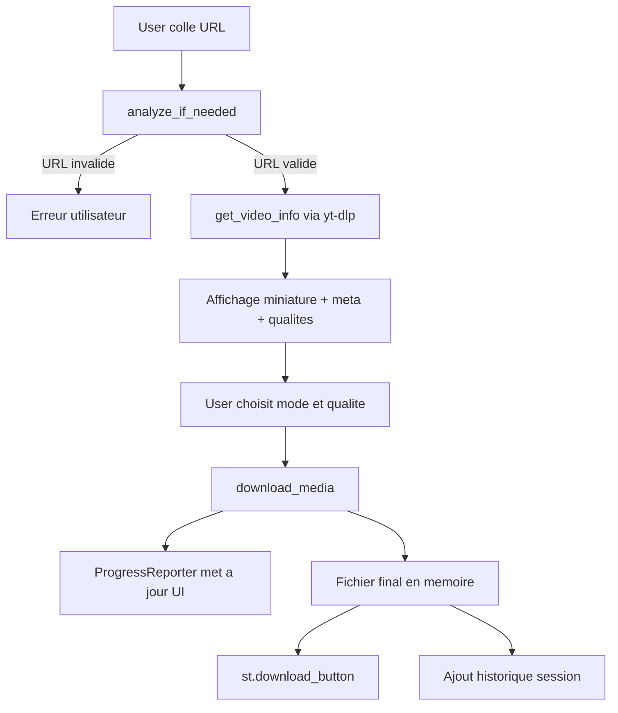

# Architecture complete de Tomitube

## 1) Objectif de l application

Tomitube est une application web Streamlit mono-fichier qui permet de:

- analyser une URL YouTube
- afficher metadonnees (titre, duree, miniature)
- proposer un choix de format (MP4 video+audio, MP3 audio)
- telecharger le media avec suivi de progression
- conserver un historique de session

Le projet est optimise pour un demarrage rapide, un deploiement simple, et une maintenance facile.

## 2) Vue d ensemble technique

- Frontend et backend sont dans la meme app Streamlit
- La logique metier de telechargement repose sur yt-dlp
- Les conversions/fusions audio-video reposent sur FFmpeg
- L etat applicatif est stocke en memoire via st.session_state
- Le style visuel est injecte via CSS personnalise dans Streamlit

## 3) Modules et responsabilites

Le code est organise par blocs de responsabilites:

1. Configuration app
- init_page: configuration Streamlit (titre, layout, icone)
- inject_styles: theme noir/blanc, cartes, boutons, responsive

2. Etat de session
- init_state: initialise les cles de session
- cles principales:
  - video_info
  - analyzed_url
  - download_ready
  - download_history

3. Validation et normalisation URL
- is_valid_youtube_url:
  - supporte youtu.be
  - supporte youtube.com/watch?v=
  - supporte shorts/embed/live
  - accepte les parametres de query (ex: si=...)

4. Extraction metadonnees
- get_video_info:
  - appel yt-dlp en mode skip_download
  - construit qualites disponibles (360p/720p/1080p)
  - retourne un objet metier unique pour l UI

5. Selection de format
- video_format_selector:
  - chaine de fallback robuste
  - priorite a bestvideo + bestaudio
  - evite les IDs de format hardcodes fragiles
  - impose un flux video avec audio present au final

6. Telechargement et conversion
- download_media:
  - cree un dossier temporaire
  - configure yt-dlp selon mode video/audio
  - mode video: fusion en MP4
  - mode audio: extraction MP3 via postprocessor FFmpeg
  - lit le fichier final en memoire pour le bouton de download
  - supprime les fichiers temporaires en finally

7. Progression
- ProgressReporter:
  - hook yt-dlp appele pendant download
  - met a jour barre de progression Streamlit
  - affiche vitesse et ETA si disponibles

8. Presentation UI
- render_header
- render_video_card
- render_thumbnail (compatibilite streamlit ancienne/nouvelle API)
- render_history
- render_download_section

9. Orchestration
- main:
  - boot app
  - gestion saisie URL
  - analyse conditionnelle
  - rendu des blocs dynamiques

## 4) Flux d execution (runtime)

## 5) Contrat de donnees principal

Objet video_info (retour get_video_info):

- title: str
- duration: str formatee
- thumbnail: str | None
- qualities: dict[int, bool]
- quality_options: list[int]
- webpage_url: str

Objet download_ready (stocke en session):

- filename: str
- mime: str
- bytes: bytes
- size_mb: float

Objet history item:

- title
- mode
- quality
- size
- timestamp

## 6) Gestion des erreurs

Hierarchie d erreurs metier:

- TomitubeError (base)
- InvalidUrlError
- VideoUnavailableError
- NetworkError

Strategie:

- classify_download_error convertit les messages yt-dlp en erreurs utilisateur lisibles
- cas traites: URL invalide, video indisponible, timeout/connexion, FFmpeg absent
- fallback defensif pour erreurs inattendues

## 7) Compatibilite Streamlit

Le rendu de miniature utilise render_thumbnail avec fallback:

- tentative use_container_width=True (API recente)
- fallback use_column_width=True en cas de TypeError (API plus ancienne)

Cela evite le crash quand la version locale de Streamlit differe.

## 8) UX, design et responsive

- Theme noir/blanc via variables CSS
- Typographies custom (Space Grotesk, Syne)
- Cartes, chips de qualite, boutons avec hover
- Animation legere (pulse + rise)
- Media query mobile pour lisibilite et densite
- Interface en mode single-column centree pour simplifier l usage

## 9) Dependances runtime

- streamlit
- yt-dlp
- ffmpeg system (obligatoire)

Sans FFmpeg:

- la fusion video+audio peut echouer
- la conversion MP3 peut echouer

## 10) Securite, limites et compromis

1. Memoire
- Le fichier telecharge est charge en RAM avant download_button.
- Pour tres gros fichiers, consommation memoire elevee possible.

2. Temps de traitement
- dependent du reseau, de la source, et de FFmpeg

3. Robustesse source
- YouTube change regulierement ses flux
- les fallbacks reduisent les pannes, mais ne garantissent pas 100%

4. Scope fonctionnel
- app orientee video unique (noplaylist=True)

## 11) Deploiement

Cible standard:

- Streamlit Community Cloud
- ou VM/container avec Python + FFmpeg

Checklist deploiement:

1. requirements.txt a la racine
2. fichier principal Tomitube.py
3. FFmpeg present sur l environnement cible
4. version Python compatible

## 12) Evolutions recommandees

1. Externaliser la logique dans un package interne:
- core/url_validation.py
- core/ytdlp_service.py
- ui/components.py

2. Ajouter tests automatiques:
- tests unitaires validation URL
- tests unitaires format selectors
- tests integration sur parsing metadonnees mockees

3. Ajouter mode streaming disque:
- eviter le chargement complet en RAM pour gros fichiers

4. Ajouter observabilite:
- logs structures
- trace des erreurs yt-dlp par categorie

---

Document genere pour decrire l architecture actuelle de l application Tomitube telle qu implementee dans Tomitube.py.
